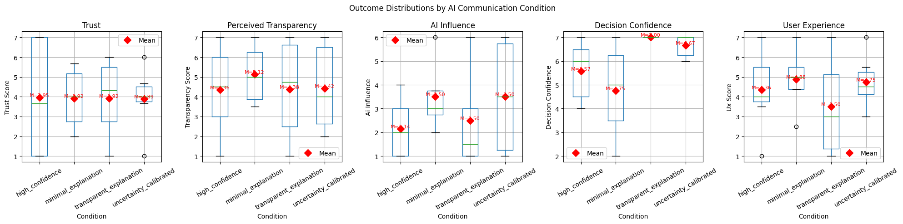

# Final Report: Trust and Reliance in AI-Assisted Decision-Making

## Introduction

This study examined how different AI communication styles shaped participants' trust, perceived transparency, self-reported AI influence, decision confidence, and user experience during a simple decision-making task. Participants reviewed a set of tasks with different deadlines and importance levels, then saw an AI recommendation about which task to complete first. The AI recommendation always pointed to the same task, but the wording varied across experimental conditions.

The study was designed to explore whether the way an AI communicates confidence and explanation changes how people interpret and rely on its recommendation. The results should be interpreted as exploratory because the sample was small, but the combined quantitative and qualitative findings provide useful insight into how participants responded to AI confidence, explanation, and uncertainty.

## Research Question

How do AI explanation style and confidence language influence perceived trust and reliance in AI-assisted decision-making?

The analysis examined whether communication style was associated with differences in trust, perceived transparency, AI influence, decision confidence, and user experience. The study also explored whether participants' written comments helped explain the quantitative patterns.

## Methods

Participants completed a short AI-assisted decision-making activity. They first answered context questions about their AI use, baseline trust in AI, and comfort using AI for decisions. They then reviewed a task-prioritization scenario and received an AI recommendation. After making a decision, participants rated their confidence, the influence of the AI, trust in the AI, perceived transparency, and user experience using 1-7 rating scales. They also answered open-ended questions about what made the AI feel trustworthy or untrustworthy, whether the explanation felt helpful, and what would improve the experience.

The cleaned dataset included 21 participant responses. Participants were current or recent university graduates (master's and PhD level), primarily university employees and AI researchers/scientists, with an age range of approximately 29–35. Participants were recruited via the researcher's professional network. Detailed demographic characteristics beyond this description were not recorded in the dataset.

Composite scores were calculated as unweighted means (simple averages) of their constituent items, with items measured on 1–7 Likert scales. Composites were rounded to two decimal places and saved in the cleaned dataset under the names shown below. No item weighting or reverse-coding was applied.

- `trust_score` = (trust_1 + trust_2 + trust_3) / 3. Range: 1–7. Stored as `trust_score`.
- `transparency_score` = (transparency_1 + transparency_2) / 2. Range: 1–7. Stored as `transparency_score`.
- `ux_score` = (ux_1 + ux_2) / 2. Range: 1–7. Stored as `ux_score`.

Each composite was computed only when all constituent items were present; if any item was missing, the composite was set to missing for that participant. Single-item measures (`ai_influence` and `decision_confidence`) were analyzed on their original rating scales.

Cronbach's alpha was computed to assess internal consistency for the multi-item scales. Results (rounded to three decimals) were: `trust_score` α = 0.899 (good), `transparency_score` α = 0.705 (acceptable), and `ux_score` α = 0.587 (questionable). Because the sample is small and some scales include only two items, these estimates should be interpreted cautiously. Composite-based inferences therefore remain primarily descriptive and exploratory.

## Random Assignment and Condition Counts

Participants were randomly assigned to one of four AI communication conditions. Each condition used a different style of recommendation language while recommending the same task.

| Condition | Description | Count |
|---|---|---:|
| High Confidence | Strong confidence language, e.g., "highly confident" and "clearly" | 7 |
| Uncertainty-Calibrated | Moderate confidence language with an explanation | 6 |
| Minimal Explanation | Short recommendation with little explanation | 4 |
| Transparent Explanation | Recommendation with explicit reasoning | 4 |

The groups were uneven and small, ranging from 4 to 7 participants per condition. Because of this, all condition-level findings should be treated as exploratory rather than definitive.

## Condition-Level Results

Trust scores were very similar across the four conditions. Mean trust ranged from 3.89 to 3.95, suggesting that communication style alone did not substantially shift overall trust in this sample.

| Condition | Trust (M, SD) | Transparency (M, SD) | AI Influence (M, SD) | Decision Confidence (M, SD) | UX (M, SD) |
|---|---:|---:|---:|---:|---:|
| High Confidence | 3.95 (3.00) | 4.36 (2.17) | 2.14 (1.35) | 5.57 (1.27) | 4.36 (1.91) |
| Minimal Explanation | 3.92 (1.71) | 5.12 (1.65) | 3.50 (1.73) | 4.75 (2.22) | 4.88 (1.84) |
| Transparent Explanation | 3.92 (2.25) | 4.38 (2.87) | 2.50 (2.38) | 7.00 (0.00) | 3.50 (2.80) |
| Uncertainty-Calibrated | 3.89 (1.64) | 4.42 (2.25) | 3.50 (2.43) | 6.67 (0.52) | 4.75 (1.37) |

Perceived transparency was highest in the Minimal Explanation condition. This was unexpected, but participant comments suggest that some users interpreted short and direct recommendations as clearer or easier to process.

Decision confidence showed the most noticeable descriptive difference. Participants in the Transparent Explanation condition reported the highest average decision confidence, followed by the Uncertainty-Calibrated condition. The Minimal Explanation condition had the lowest average decision confidence.

AI influence was highest in the Minimal Explanation and Uncertainty-Calibrated conditions and lowest in the High Confidence condition. User experience was highest for Minimal Explanation and lowest for Transparent Explanation, which may suggest a tradeoff between explanation detail and ease of use.

## Exploratory Statistical Tests

Kruskal-Wallis tests were used to examine whether outcome distributions differed across the four conditions. This nonparametric test was appropriate because the outcomes were based on Likert-style ratings and the group sizes were small and uneven.

None of the five outcomes differed significantly across conditions at the $p < .05$ level:

| Outcome | Kruskal-Wallis H | p-value |
|---|---:|---:|
| Trust | 0.017 | .9994 |
| Perceived Transparency | 0.464 | .9267 |
| AI Influence | 2.432 | .4877 |
| Decision Confidence | 7.499 | .0576 |
| User Experience | 0.917 | .8213 |

Decision confidence came closest to significance, $H = 7.499, p = .0576$, suggesting a possible condition-level pattern. However, it did not meet the conventional threshold for statistical significance.

Follow-up pairwise comparisons for decision confidence suggested that Transparent Explanation had higher confidence than High Confidence and Minimal Explanation before correction. After Holm and Bonferroni adjustments, no pairwise comparisons remained significant. These pairwise findings should therefore be interpreted as exploratory.

Brown-Forsythe tests were used to examine whether variability differed by condition. Decision confidence was the only outcome with significantly different variance across conditions, $p = .0084$. This suggests that communication style may have affected how consistent participants' confidence ratings were, even though average differences did not reach statistical significance.

## Correlation and Regression Findings

Pearson correlations were used to examine relationships among the main study measures. The clearest relationship was between perceived transparency and trust, $r = 0.696, p = .0005$. Participants who rated the AI as more transparent also tended to report higher trust.

Baseline trust and comfort were also positively related, $r = 0.582, p = .0057$. Participants who generally trusted AI recommendations tended to feel more comfortable using AI to support decisions.

Trust was not significantly associated with AI influence, $r = -0.257, p = .2609$. Baseline trust was also not significantly associated with AI influence, $r = 0.263, p = .2485$. These findings suggest that trust and influence were not the same construct in this study. Participants could trust the AI without reporting that it strongly influenced their decision.

Decision confidence was moderately positively related to trust, $r = 0.374, p = .0944$, but this relationship was not statistically significant. This may indicate a possible trend in which participants who trusted the AI felt more confident, but the small sample limits interpretation.

An OLS regression examined whether trust, transparency, and baseline trust predicted AI influence. The overall model explained 28.7% of the variance in AI influence, $R^2 = .287$, but was not statistically significant, $F(3, 17) = 2.277, p = .116$.

Trust was a significant negative predictor of AI influence, $b = -0.570, p = .043$, after controlling for transparency and baseline trust. This means that higher trust was associated with lower reported AI influence in the model. This counterintuitive pattern may reflect the difference between agreement and influence: participants may have trusted the AI because it matched their own reasoning, not because it changed their decision. Transparency showed a positive but non-significant trend, $b = 0.524, p = .063$, and baseline trust was not significant, $b = 0.245, p = .371$.

## Qualitative Findings by Condition

### High Confidence

Responses in the High Confidence condition were mixed. Some participants trusted the AI because it identified the most urgent task or matched their intuitive answer. For these participants, confidence language seemed acceptable when the recommendation felt obvious.

Other participants reacted negatively to the strong wording. One participant described "clearly" as a red flag, and others wanted more explanation. This suggests that high-confidence language can backfire when users feel the certainty is not sufficiently supported.

### Minimal Explanation

Participants in the Minimal Explanation condition often described the recommendation as quick, logical, and straight to the point. Some participants appeared to value the simplicity of the response.

However, minimal explanation was not universally effective. One participant found the recommendation untrustworthy because it seemed unusual or insufficiently justified. This suggests that concise recommendations may work well when the answer feels intuitive, but they may not provide enough support when users question the recommendation.

### Transparent Explanation

Participants in the Transparent Explanation condition also gave mixed responses. Some found the explanation helpful because it showed the AI's reasoning and made the recommendation easy to follow.

Others were more skeptical. The participant who expressed the strongest skepticism in this condition also described having low baseline trust in AI and said they would need more data before increasing trust. Another participant felt the explanation was excessive and went beyond the available information. This directly links the qualitative feedback to the quantitative finding that baseline trust and comfort were related, and it suggests that transparency is useful when it is grounded and relevant, but too much explanation can feel speculative.

### Uncertainty-Calibrated

Participants in the Uncertainty-Calibrated condition often recognized that the AI's reasoning was logical. However, some participants reacted negatively to uncertainty language. Words such as "moderately" or mild confidence made the AI feel less trustworthy to some users.

Several participants wanted more examples, more context, or more conditional reasoning. This suggests that uncertainty should be paired with enough explanation to help users understand why the AI is uncertain and what evidence supports the recommendation.

## Mixed-Methods Synthesis

The quantitative and qualitative findings point to the same broader conclusion: trust, transparency, and influence are related but distinct. Quantitatively, transparency was strongly associated with trust, but trust was not significantly associated with AI influence. Qualitatively, participants often trusted the AI when its recommendation aligned with their own reasoning. In other words, trust sometimes reflected agreement rather than reliance.

The condition-level statistical tests did not show significant differences in most outcomes, but decision confidence stood out. It had the strongest Kruskal-Wallis pattern and significantly different variance across conditions. Participant comments help explain why: confidence language was interpreted differently by different users. Strong confidence could seem useful or overconfident, while uncertainty language could seem appropriately cautious or less trustworthy.

The qualitative responses also help explain why Minimal Explanation performed unexpectedly well on perceived transparency and user experience. Some participants found short recommendations easier to understand. This suggests that perceived transparency is not only about the amount of explanation. It is also about clarity, fit, and whether the explanation feels necessary for the decision.

Overall, participants preferred AI recommendations that were concise, logical, and grounded in visible evidence. Both unsupported certainty and vague uncertainty created skepticism.

## Responsible AI Design Recommendations

AI systems should distinguish between trust and reliance. A user may trust a recommendation because it matches their reasoning without relying on the AI to make the decision. Future studies and interfaces should measure this distinction directly by asking for a user's initial decision before showing the AI recommendation, then measuring whether the recommendation changed the decision.

AI explanations should be concise but evidence-based. More explanation is not always better. The explanation should connect directly to the task information and avoid claims that go beyond the available evidence.

Confidence language should be calibrated carefully. Strong claims such as "clearly" should be used only when the evidence is obvious and the reason is stated. Uncertainty language should be paired with an explanation of why uncertainty exists and what information would reduce it.

AI interfaces should support user agency. Participants valued using AI as a guide rather than a replacement for their own judgment. Responsible design should make it easy for users to compare the AI recommendation with their own reasoning.

AI systems should adapt to user context and baseline attitudes. Some participants were generally skeptical of AI, while others trusted AI based on prior experience. Users with low baseline trust may need more evidence and clearer boundaries around what the AI can and cannot infer.

Finally, AI recommendations should make reasoning visible without overwhelming the user. The most responsible design pattern suggested by this study is not maximum explanation or maximum confidence, but calibrated support: a recommendation that is clear, justified, appropriately cautious, and respectful of the user's final decision authority.
